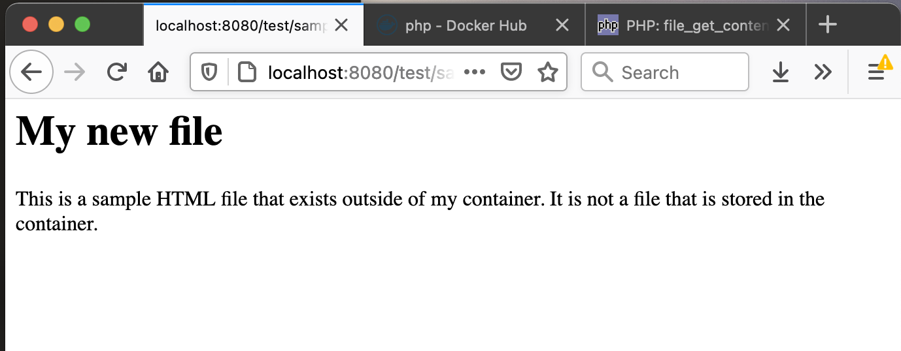

# Disk and Volume Mounting

In this section you will map a directory inside a container to a directory outside of the container.  These are called volumes, and it is the second way (other than environment variables) to pass information into a container (without having to rebuild the container).  Volume and Environment variable mappings are the main ways the Kubernetes ConfigMaps and Secrets work.


1. Terminate any locally running docker applications.
```shell
docker rm -f $(docker ps -a -q)
```

2. Create a separate directory for us to map to (this way we won't accidently mess up our existing application files).  Change in this directory.

```shell
mkdir data
cd data
```

2. With your text editor create a new HTML file.
```shell
nano sample.html
```

3. Add any HTML you want to the file.  For example:
```html
<h1>My new file</h1>
<p>This is a sample HTML file that exists outside of my container.  It is not a file that is stored in the container.
</p>
```
Save the file.

4. Start the application again, this time passing in a volume mounting argument.
```shell
docker run -d -p 8080:80 -e MY_VAR="Hey" -v $(pwd):/var/www/html/test app1
```
The volume mounting argument, like the port mapping argument, accepts a string separated with a color.  The part before the colon is the directory on the hostmachine (your laptop).  The part after the colon is where this directory will show up inside the container.  In this case the current directory (as determined by the linux print working directory `pwd` command), and which happens to be the directory `data that you created` is the external volume.  Internally this directory will appear as a subdirectory named `test` in the main HTML directory where Apache looks for files.

5. Test the volume mount by having an external browser request the file you created on the host machine (and did NOT rebuild into the container image).   Use the URL http://localhost:8080/test/sample.html.  



6. Now edit that text file again.
```shell
nano sample.html
```

7. Make some changes to the file that you will notice, then Save the file.

8. Refresh the browser window and you should see your changes.

This demonstrates and verifies that the content for this web page is coming from a file that exists on your laptop, and that is not part of the built container.  This is a way information can be provided to a container that has already been built, without having to rebuild it.

## Writing to volume


9. Terminate the locally running applications.
```shell
docker rm -f $(docker ps -a -q)
```

10. Change back to the App1 directory (if you are still in the `data` directory, just move up one with `cd ..`).

11. Edit the `index.php` file and update the contents to the following.  Then Save and Exit.
```shell
<h1>App1</h>

<h2>
<?php
    echo "The environment variable MY_VAR is " . $_ENV["MY_VAR"]
?>


<?php
  // append to file
  $msg = $_GET["msg"]."\n";
  $outfile = fopen("/data/out.txt", "a");
  fwrite($outfile,$msg);
  fclose($outfile);

?>
</h2>

```

This additional PHP block of code will get the value of a URL query parameter from the requesting URL and put it in the variable `$msg`.  Next the file `/data/out.txt`  is opened for appending to.  This file location is inside the container.

The value of the query parameter is appended to the file, and then it is closed, before the HTML page is returned to the requesting browser.

This means when a browser requests this page and passes in a query parameter value it will be written to a file in the container.  If the directory of the file is mapped to an external directory then the update happens outside of the container.

12. Rebuild the container image.
```shell
docker build -t app1 .
```

13. Run the application with a volume mapping that will make the internal container directory `/data` map to the external directory `data` which is a sub directory of our App1 project.
```shell
docker run -d -p 8080:80 -e MY_VAR="something" -v $(pwd)/data:/data app1
```

14.  Now test the application with a value for the query parameter `msg`.  For example open up the URL http://localhost:8080?msg=foobar.

You should see the page render as before.

15. Verify that the `out.txt` file got created and updated by listing the contents of the local `data` directory.
```shell
ls data
```
Where you should see the newly created `out.txt` file.

16. Dump the contents of the `out.txt` file to see your message in it.
```shell
cat data/out.txt
```
You should see the value of the `msg` query parameter displayed.

This demonstrates how a container can be used to update files on an external (shared) disk.  Kubernetes volumes use this ability to allow containers running in pods to have persistent storage (storing information even after the container has been destroyed).

----
[Overview](README.md)