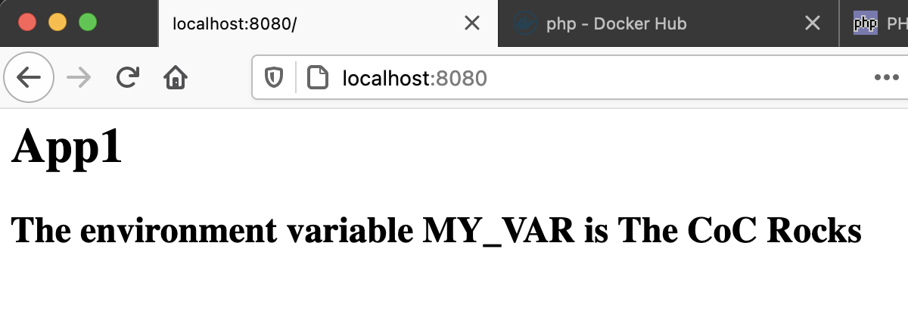

# Environment Variables

In this section you will update the application to read and display an environment variable passed into the container.  This is one of two primary ways to pass configuration information into a container, both when running under docker alone and when running in Kubernetes.


1. Terminate any locally running docker applications.
```shell
docker rm -f $(docker ps -a -q)
```

2. Edit the App1 index.php file.  Update the contents to the following.
```shell
<h1>App1</h>

<h2>
<?php
    echo "The environment variable MY_VAR is " . $_ENV["MY_VAR"]
?>
</h2>
```
The special PHP map `$_ENV[]` holds all the environment variables.  We request the variable `MY_VAR` by specifying it as the key.  The result is the value (if any) of teh environment variable passed to the container when it was started.

This value is appened to the string and included with the HTML output.

3. Rebuild the image (since we changed its contents).
```shell
docker build -t app1 .
```

4. Run the newly updated container image, this passing in an environment variable value.
```shell
docker run -d -p 8080:80 -e MY_VAR="The CoC Rocks" app1
```

5. Verify application change with your local browser on the url http://localhost:8080.


----
[Overview](README.md)