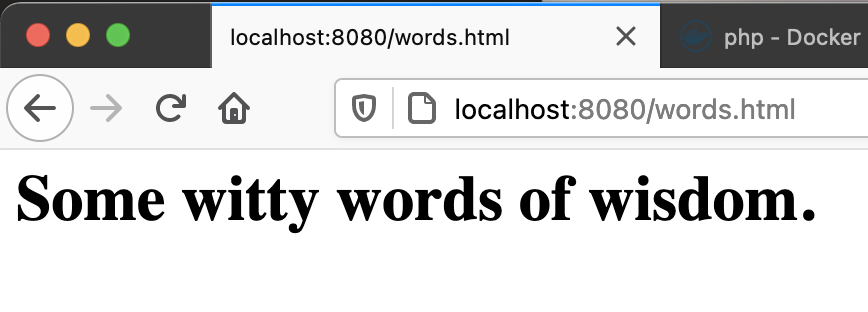

# Shelling into a Running Container

In this section you will run a container, and then login to that container with a secure shell (`ssh`) using the Docker `exec` command.  This command lets you directly run commands inside of the container. 


1. Run App1 (if it is not already running).
```shell
docker run -d -p 8080:80 app1
```

2. Get the container id (or automatically generated name) by listing all the containers.
```shell
docker ps -a
```

3. Use the `docker exec` command to open up an *interactive terminal* using the `bash` shell interpreter into the container.
```shell
docker exec -it ###### /bin/bash
```
Where `#######` is the container id or name of your locally running container instance.

You should notice the terminal prompt change to something like `root@282b06c10688:/var/www/html#`.  This means you are inside the container and any command that you enter will be run as a user inside the container.

4. Verify the current user name with the comand:
```shell
whoami
```
It should respond with `root`.  You are the `root` user inside this container.

5. Get a complete listing of all the files in the current directory with:
```shell
ls -la
```
You should see three entries, with one of them being the index.php file that makes up the application.

6. Create a brand new HTML file with the command:
```shell
echo "<h1>Some witty words of wisdom.</h1>" > words.html
```
This command will send the text between the quotes to a file called `words.html`.  Since this file is in the Apache web server home directly it can be requested by an external web browser.

7. Request this new file by using the URL `http://localhost:8080/words.html` in a web browser on your local laptop.


8. Exit out of the shell with the `bash` `exit` command.
```shell
exit
```
You should see your familiar local laptop command prompt return.

----
[Overview](README.md)