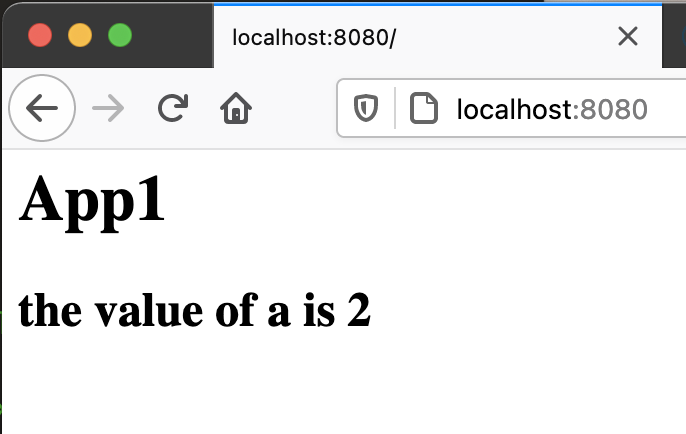

# Simple PHP App

In this section you will create a new application using the PHP runtime.  PHP is a old server side web templating engine that makes it very easy for us to simply create applications that both provide a renderable web page, and that can do server side processing.

In your terminal window:

1. Create a new sub directory in some working directly on your laptop.  It can be anywhere, just remember where it is.  Then change to that directory.

```shell 
mkdir app1
cd app1
```

2. Create the main app file `index.php` with a text editor (we use `nano` in these examples but you can use `vi` or any other terminal based text editor of your choice).

```shell
nano index.php
```

Enter in the following contents to the file.
```php
<h1>App1</h>

<h2>
<?php 
    $a = 1 + 1;
    echo "the value of a is " . $a
?>
</h2>
```
Save the file (Ctrl-O, Enter) then exit (Ctrl-X).

When this page (which is the default page) is run in a PHP container and is requested by a web browser, will pass through all the HTML content.  When it get to a `<?php ... ?>` block, it will process the contents in the block on the server.  The PHP `echo` command will include output into the data streamed to the requesting web browser.

The result should be the display the main title **App1** and the results of the server side processing of the simple math equation and output  "**the value of a is 2**".

3. Create the Dockerfile, which defines what base image to start from and what the contents of the container should be.  Using a text editor edit a new file called `Dockerfile`.
```shell
nano Dockerfile
```
Add the following to the file
```
FROM php:7.2-apache
COPY index.php /var/www/html/
```
Save the file (Ctrl-O, Enter) then exit (Ctrl-X).

This will make `PHP` with the tag `7.2-apache` the base image to which will will define additional layers.  

The next command is to copy the `index.php` file to the container's `/var/www/html` directory (where the Apache web server looks for files to return to web browsers).

Save the file.

4. Build a container image and store it in the local registy with the name `app1`.
```
docker build -t app1 .
```
The `docker build` command expects as a required argument the *directory* where it can find a file named `Dockerfile`.  The character `.` is a shorthand notation for the current directory.

This build command also has the optional argument `-t` which specifies the **tag** of the image (its name). In this case we tag the newely created image `app1`.

5. Run the container locally with the command:
```shell
docker run -d -p 8080:80 app1
```
In this command the `-d` argument means to detach from the container when it is run (otherwise the terminal window will be stuck displaying the logs of the container).  

The `-p` argument with the value `8080:80` means to link the local laptop's network port `8080` to the container's internal network port `80`.  Port `80` is the default port that the Apache application is listening to.

The final argument is the container's image name, `app1`.

6. Test the running application by opening up a web browser on the URL `http://localhost:8080`.  You should see the rendering of the simple `index.php` file.



7. Try running another copy of the appication on a different port.

8. To remove the container you should determine its container id or name with the command
```shell
docker ps -a
```

9. Then with the name or id remove it with the command:
```shell 
docker rm -f #######
``` 
where `########` is your container id or name.

10. Another handy command to remove **ALL** containers (running or exited) is:
```shell
docker rm -f $(docker ps -a -q)
```

-----
[Back to Overview](README.md)